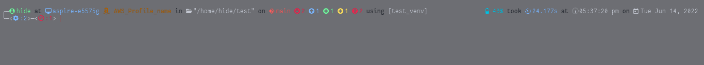
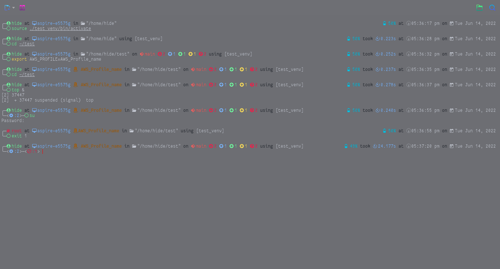
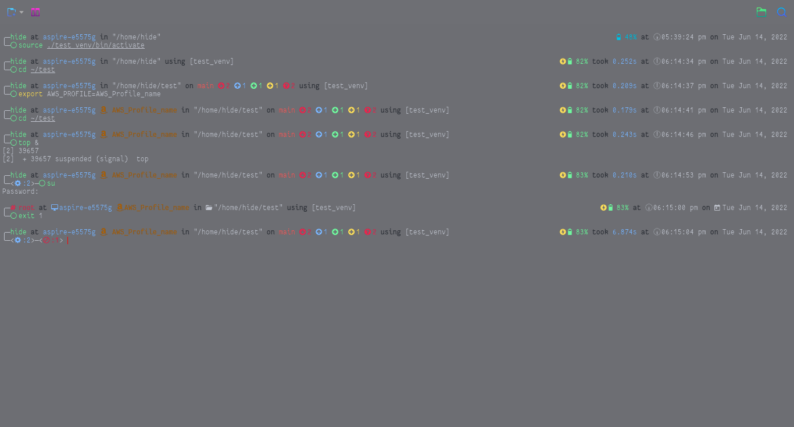

# acenoster.zsh-theme

A multipurpose ZSH theme.

**Example prompt when at home directory:**


**Example showing all information possible in a single prompt:**



# Prerequisites:

* An Unix like Operating system like Linux, MacOS, BSD, Android (Termux) etc or WSL (Windows Subsystem for Linux), cygwin or msys if you want to use in Windows.
* zsh should be installed. See [how to install zsh in various platforms](https://github.com/ohmyzsh/ohmyzsh/wiki/Installing-ZSH#how-to-install-zsh-on-many-platforms).
* oh-my-zsh should be installed. See [how to install oh-my-zsh](https://ohmyz.sh/#install).
* You will need to install any one [Nerd font](https://www.nerdfonts.com) and use it in your terminal for this theme to render the icons correctly.
  * Download any of the fonts you like from [here](https://www.nerdfonts.com/font-downloads).
  * Extract the downloaded `.zip` file and copy its contents into a folder in either `\usr\share\fonts` or `~\.local\share\fonts`.

## How to install and use:

* Make sure you are using zsh and execute any one of the following commands given below to install the acenoster theme.

  * using git
    ```
    git clone https://github.com/HimDek/Acenoster-ZSH-Theme.git $ZSH/custom/themes/acenoster
    ```
  * using wget
    ```
    wget http://url.himdek.com/acenostertheme -O $ZSH/custom/themes/acenoster/acenoster.zsh-theme
    ```

* Enable acenoster theme by editing the `~/.zshrc` file. In that file, change the line containing `ZSH_THEME="SomeName"` to `ZSH_THEME="acenoster/acenoster"`.

## What does it show?

The following tables show which information are shown in the prompt in sequential order.

* \* denotes visible only when applicable.
* \*\* indicates disabled by default.
* The corresponding oh-my-zsh plugin needs to be enabled in order for its info to be shown.
* To disable an info, either disable its corresponding oh-my-zsh plugin, set its corresponding toggle variable to `0` or unset its corresponding format specifier variable. See [how to enable or disable oh-my-zsh plugins](https://github.com/ohmyzsh/ohmyzsh/wiki/Plugins).
* The default values of toggle and format specifier variables with additional information are given [further down](#info-toggles-set-to-0-for-off-1-for-on).

### Left pre prompt:

<table>
  <tr>
    <th>Info</th>
    <th>oh-my-zsh plugin</th>
    <th>Toggle variable</th>
    <th>Format specifier variable</th>
  </tr>
  <tr>
    <td>Username</td>
    <td></td>
    <td>ZSH_THEME_ACENOSTER_ALWAYS_SHOW_USER</td>
    <td>ZSH_THEME_ACENOSTER_USER_PROMPT_FORMAT</td>
  </tr>
  <tr>
    <td>Hostname</td>
    <td></td>
    <td>ZSH_THEME_ACENOSTER_ALWAYS_SHOW_HOST</td>
    <td>ZSH_THEME_ACENOSTER_HOST_PROMPT_FORMAT</td>
  </tr>
  <tr>
    <td>*AWS profile name</td>
    <td>aws</td>
    <td></td>
    <td></td>
  </tr>
  <tr>
    <td>Current working directory</td>
    <td></td>
    <td></td>
    <td>ZSH_THEME_ACENOSTER_DIR_PROMPT_FORMAT</td>
  </tr>
  <tr>
    <td>*git branch, tracking and local status</td>
    <td>git-prompt</td>
    <td></td>
    <td></td>
  </tr>
  <tr>
    <td>** *Mercurial branch, tracking and local status</td>
    <td></td>
    <td>ZSH_THEME_ACENOSTER_SHOW_HG_PROMPT</td>
    <td></td>
  </tr>
  <tr>
    <td>*Virtual environment name</td>
    <td>virtualenv</td>
    <td></td>
    <td></td>
  </tr>
</table>

### Right pre prompt:

<table>
  <tr>
    <th>Info</th>
    <th>oh-my-zsh plugin</th>
    <th>Toggle variable</th>
<th>Format specifier variable</th>
  </tr>
  <tr>
    <td>*Battery percentage and status</td>
    <td></td>
    <td>ZSH_THEME_ACENOSTER_SHOW_BATTERY</td>
    <td></td>
  </tr>
  <tr>
    <td>*Last command execution time</td>
    <td></td>
    <td>ZSH_THEME_ACENOSTER_SHOW_TIMER</td>
    <td></td>
  </tr>
  <tr>
    <td>Emoji clock</td>
    <td>emoji-clock</td>
    <td></td>
    <td></td>
  </tr>
  <tr>
    <td>Digital clock</td>
    <td></td>
    <td></td>
    <td>ZSH_THEME_ACENOSTER_CLOCK_PROMPT_TIME_FORMAT</td>
  </tr>
  <tr>
    <td>Calendar</td>
    <td></td>
    <td></td>
    <td>ZSH_THEME_ACENOSTER_CALENDAR_PROMPT_DATE_FORMAT</td>
  </tr>
</table>

### Left Prompt:

<table>
  <tr>
    <th>Info</th>
    <th>oh-my-zsh plugin</th>
    <th>Toggle variable</th>
 </tr>
  <tr>
    <td>*Number of background processes</td>
    <td></td>
    <td>ZSH_THEME_ACENOSTER_SHOW_BACK_JOBS</td>
  </tr>
  <tr>
    <td>*Last command return value</td>
    <td></td>
    <td>ZSH_THEME_ACENOSTER_SHOW_LAST_RETURN</td>
  </tr>
  <tr>
    <td>*Vi normal mode indicator</td>
    <td>vi-mode</td>
    <td>ZSH_THEME_ACENOSTER_SHOW_VI_MODE</td>
  </tr>
</table>

## Environment variables:

Below are the default values of environment variables used by this prompt. To customize any of them, unset or set a new value in the `~/.zshrc` file.

### Info Toggles:  Set to `0` for off, `1` for on.

```
  ZSH_THEME_ACENOSTER_ALWAYS_SHOW_USER=1
  ZSH_THEME_ACENOSTER_ALWAYS_SHOW_HOST=1
  ZSH_THEME_ACENOSTER_SHOW_HG_PROMPT=0
  ZSH_THEME_ACENOSTER_SHOW_BATTERY=1
  ZSH_THEME_ACENOSTER_SHOW_TIMER=1
  ZSH_THEME_ACENOSTER_SHOW_BACK_JOBS=1
  ZSH_THEME_ACENOSTER_SHOW_LAST_RETURN=1
  ZSH_THEME_ACENOSTER_SHOW_VI_MODE=1
```

* See [this](#what-does-it-show) to know which is what.
* Turning off `ZSH_THEME_ACENOSTER_ALWAYS_SHOW_USER` which is on by default will hide the user name unless it is root or in an SSH shell.
* Turning off `ZSH_THEME_ACENOSTER_ALWAYS_SHOW_HOST` which is on by default will hide the host name unless it is in an SSH shell.
* Turning on `ZSH_THEME_ACENOSTER_SHOW_HG_PROMPT` which is off by default will enable the [mercurial](https://www.mercurial-scm.org/) info of the prompt. Mercurial is a SCM (Source Control Management) tool just like git. Although not as popular as git, it is still used in many projects.
* `ZSH_THEME_ACENOSTER_SHOW_BATTERY` which is on by default is the toggle for the battery capacity icon and percentage in the prompt.
* `ZSH_THEME_ACENOSTER_SHOW_TIMER` which is on by default is the toggle for the timer that shows the time taken by the previous command run in the terminal.
* `ZSH_THEME_ACENOSTER_SHOW_VI_MODE` which is on by default is the toggle for the Vi normal mode inicator
* `ZSH_THEME_ACENOSTER_SHOW_BACK_JOBS` which is on by default is the toggle for the indicator that shows if any background process is running in the current terminal.
* `ZSH_THEME_ACENOSTER_SHOW_LAST_RETURN` which is on by default is the toggle for the indicator that shows if the last command exited with a non zero return value. 

### Info Format specifiers:

```
  ZSH_THEME_ACENOSTER_USER_PROMPT_FORMAT="%n"
  ZSH_THEME_ACENOSTER_HOST_PROMPT_FORMAT="%m"
  ZSH_THEME_ACENOSTER_DIR_PROMPT_FORMAT="%~"
  ZSH_THEME_ACENOSTER_CLOCK_PROMPT_TIME_FORMAT="%I:%M %P"
  ZSH_THEME_ACENOSTER_CALENDAR_PROMPT_DATE_FORMAT="%a %b %d"
```

* See [this](#what-does-it-show) to know which is what.
* If you don't want to see any of these info in the prompt, then unset the corresponding variable by inserting a line with the command `unset variableName` into the `~/.zshrc` file.

### Settings: Set to `0` to disable, `1` to enable.

```
  ZSH_THEME_ACENOSTER_FLUENT_FLOW=1
  ZSH_THEME_ACENOSTER_LESS_ICONS=0
  ZSH_THEME_ACENOSTER_COMPACT=0
```

* Enabling `ZSH_THEME_ACENOSTER_FLUENT_FLOW` which is enabled by default shows the connecting words like `at`, `in`, `took`, `on` etc in a dull color between different parts of the prompt to make them seem connected and unified while not being too intrusive.
* Enabling `ZSH_THEME_ACENOSTER_LESS_ICONS`, which is disabled by default will show only those icons in the prompt that indicate a status.
* Enabling `ZSH_THEME_ACENOSTER_COMPACT` which is disabled by default will remove the empty line before every prompt.

### Battery levels:

```
  ZSH_THEME_ACENOSTER_BATTERY_HIGH=80
  ZSH_THEME_ACENOSTER_BATTERY_LOW=40
  ZSH_THEME_ACENOSTER_BATTERY_CRIT=20
```

### Colors:

```
  COLOR_AWS="%{$FG[130]%}"            # Used by the AWS icon and profile name text.
  COLOR_GIT="%{$FG[203]%}"            # Used by the git icon and branch name text.
  COLOR_HG="%{$FG[244]%}"             # Used by the mercurial icon and branch name text.
  COLOR_BATTERY_FULL="%{$FG[040]%}"   # Used by the battery full icon and "100%" text.
  COLOR_BATTERY_NORMAL="%{$fg[cyan]%}"
  COLOR_DULL="%{$fg[black]%}"
  COLOR_RED="%{$fg[red]%}"
  COLOR_GREEN="%{$fg[green]%}"
  COLOR_BLUE="%{$fg[blue]%}"
  COLOR_YELLOW="%{$fg[yellow]%}"
  COLOR_RESET="%{$reset_color%}"
```
* `COLOR_BATTERY_NORMAL` is the color used by the battery icon and percentage text when it is between the values of `ZSH_THEME_ACENOSTER_BATTERY_HIGH` and `ZSH_THEME_ACENOSTER_BATTERY_LOW` as set in [Battery levels](#battery-levels) section.
* `COLOR_DULL` is the color used by the connecting words like `at`, `in`, `took`, `on` etc shown between different parts of the prompt when `ZSH_THEME_ACENOSTER_FLUENT_FLOW` is enabled as described [here](#settings-set-to-0-to-disable-1-to-enable).
* Other colors are used by several parts of the prompt to indicate different states in general.

## Screenshots:

**Default prompt showing all possible information:**



**Same as above but with `ZSH_THEME_ACENOSTER_LESS_ICONS` turned on:**


